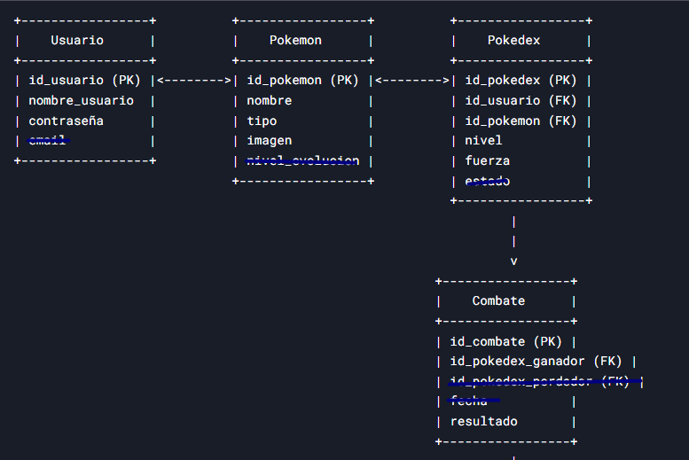

# PokemonSymfony
Aplicación realizada en Symfony

Nos piden hacer una aplicación para coleccionar pokemons y obligarlos a enfrentarse entre ellos, para verlos sufrir.

El sistema tendrá un conjunto de pokemon {numero, nombre, tipo {fuego, agua, tierra, electrico...}, imagen}. Estos pokemon los puede añadir el administrador.

Los usuarios registrados podrán recoger pokemon aleatorios. Para ello presionan un botón de cazar pokemon. Se les muestra un pokemon aleatorio de los que hay en el sistema.
El usuario puede decidir entre dejarlo escapar o tirarle una pokeball (intentar cazarlo). Si se escapa, se olvida. Si tira la pokeball debe tener un 60% de probabilidad de caza exitosa.

Cuando caza un pokemon pasa a estar en su pokedex con nivel 1 y fuerza 10.

El usuario podrá entrenar a un pokemon. Al entrenarlo incrementa su fuerza en 10.

El usuario podrá enfrentar su pokemon a otro pokemon aleatorio (con nivel y fuerza aleatorios, pero os recomiendo poner un margen bajo para que sean malos y sea mas facil ganarles, como alimañas que son).

La batalla de pokemon transcurre de la siguiente forma:

Se compara entre ambos pokemon el valor resultante de multiplicar el nivel por la fuerza. El que tenga valor mayor, gana.

El pokemon que gana sube de nivel.

El que pierde, sufre la presión social y miradas de soslayo por ser un bicho perdedor, mientras su entrenador disfruta viendo sufrir al pobre bicho.

Queremos ver a qué pokemon se ha enfrentado y el resultado del enfrentamiento.

